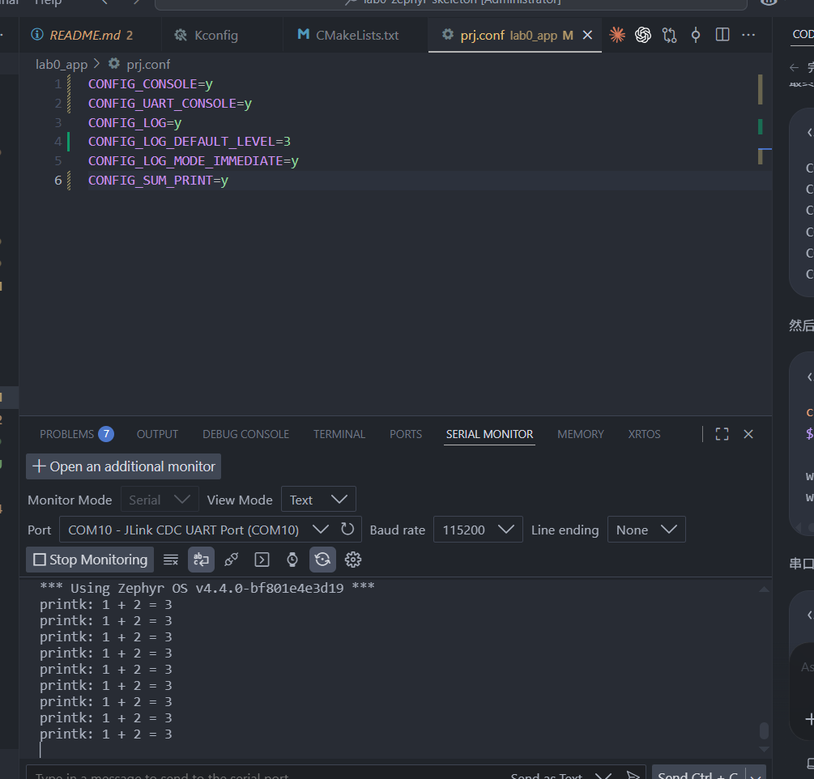

# Lab 0 Blinky application

This application uses nRF Connect SDK v3.4.0 and the
`nrf7002dk/nrf5340/cpuapp/ns` target. It toggles LED0 every 2000 ms:
two seconds on and two seconds off, for a four-second full cycle.

## Files

- `src/main.c`: GPIO initialization, LED toggling, and thread sleep.
- `prj.conf`: enables GPIO support through Kconfig.
- `CMakeLists.txt`: selects Zephyr and adds the application source.
- `boards/nrf7002dk_nrf5340_cpuapp_ns.overlay`: the lab appendix's
  no-MCUboot partition layout for NCS 3.4.0.

## Local Windows build

SDK: `D:\ncs\v3.4.0`.
`D:\ncs\lab0-app` is a directory junction to this application in the
original repository. It avoids Windows cross-drive path errors without
duplicating the source files. Build outputs stay outside the repository.

Run in an nRF Connect terminal with the v3.4.0 toolchain:

```powershell
$env:PYTHONUTF8 = '1'
cd D:\ncs\v3.4.0\zephyr
west build -p always -b nrf7002dk/nrf5340/cpuapp/ns -d D:\ncs\lab0-build-ns D:\ncs\lab0-app --sysbuild
west flash -d D:\ncs\lab0-build-ns --dev-id 1050773318
```

`PYTHONUTF8` avoids the TF-M manifest generator's GBK decoding error on
this Windows installation. Replace the device ID when using another board.

## Video evidence

Record the original one-second toggle interval, then the code change,
build and flash terminal output, and the two-second toggle interval.
The handout requests the filename `f26_lab0_2.1_pennkey` for question 2.2.
Replace `pennkey` with your own PennKey. Hardware observation and the video
are required separately from successful compilation.

This Nordic SDK application does not replace the vanilla Zephyr work
required for section 1.


