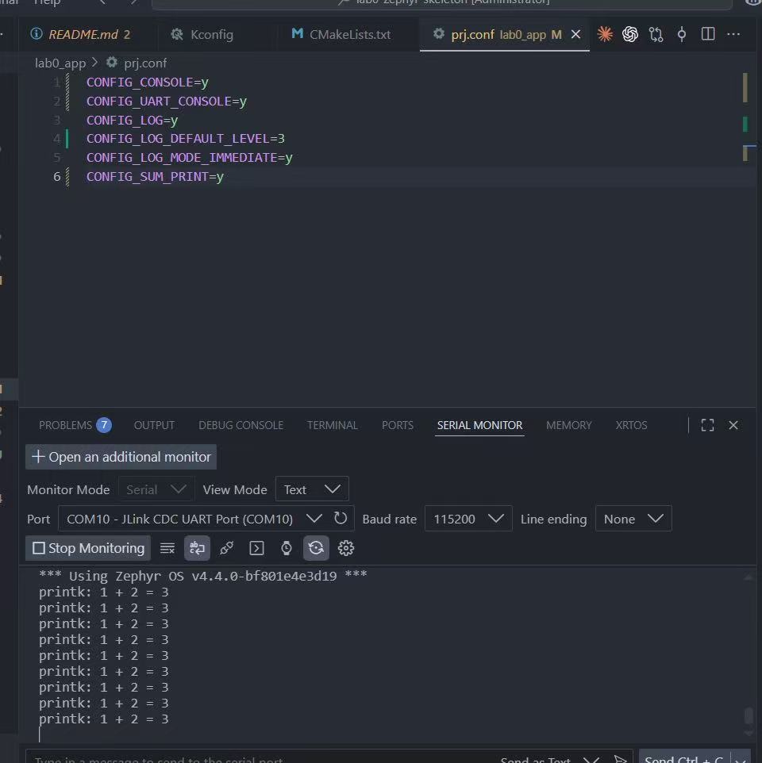
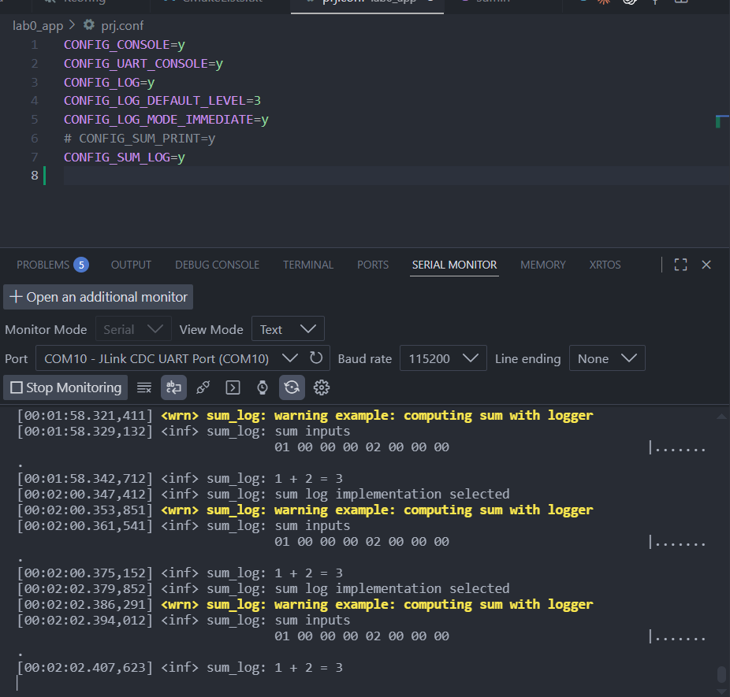
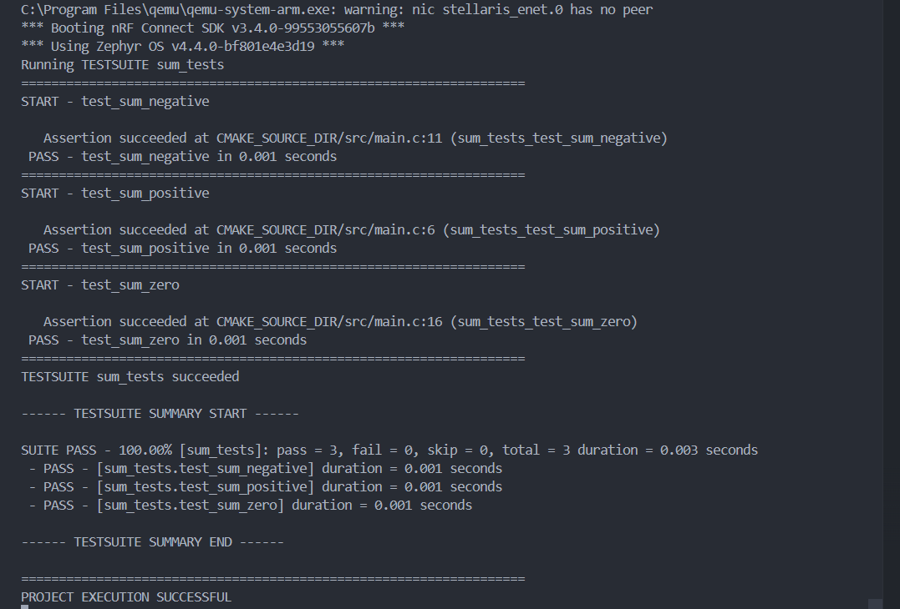
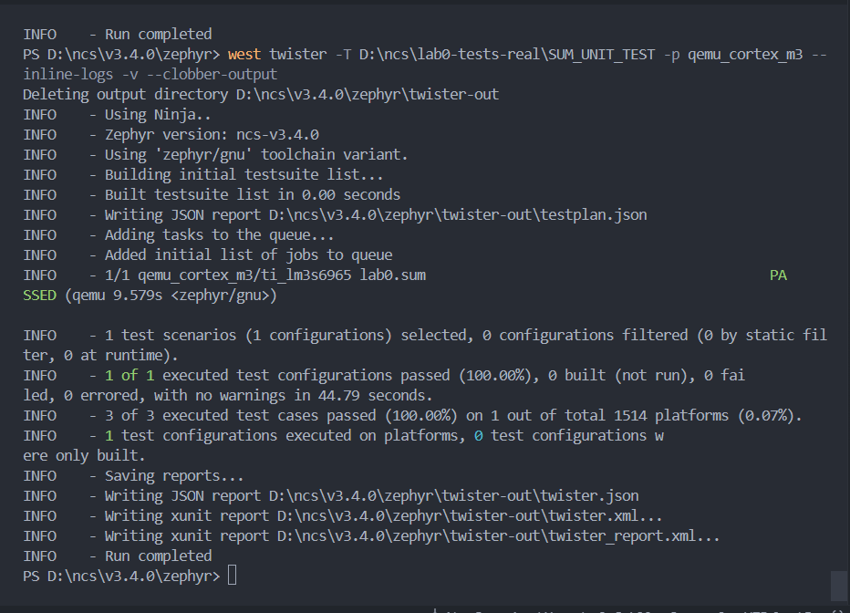
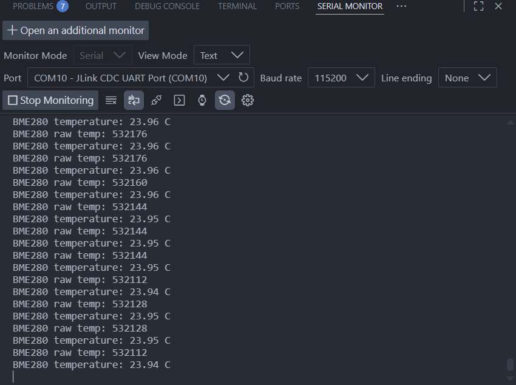
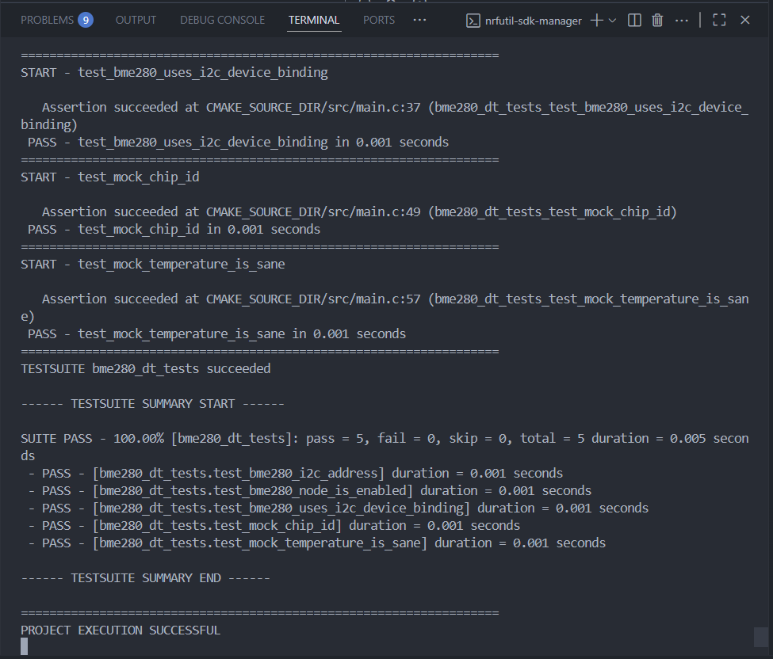
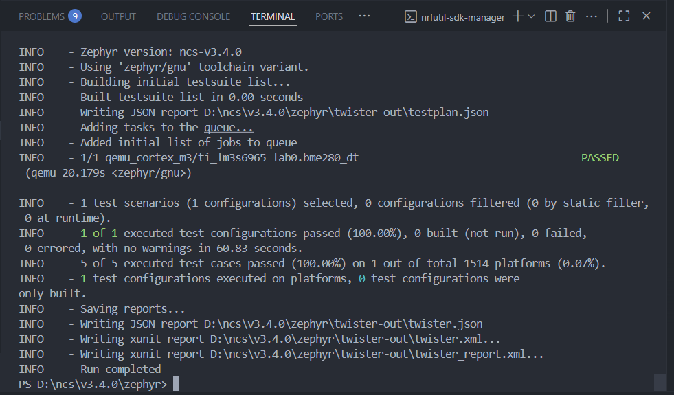

# ESE5180 Lab 0 Zephyr

| Team member | Email                        |
| ----------- | ---------------------------- |
| Silin Chen  | chen47@engineering.upenn.edu |

GitHub repository: https://github.com/curious88sniper/ese5180-lab0.git

## 1. Vanilla Zephyr Blinky

Video for this section is submitted separately through the course Google Form as required by the assignment.

## 2. nRF Connect SDK Blinky

Video for this section is submitted separately through the course Google Form as required by the assignment

## 3. Building With West

### 3.1 Build and Flash Screenshots

Build output:


Flash output:


### West Commands

- `west init`: Initializes a Zephyr workspace and configures the manifest repository.
- `west update`: Downloads and checks out the repositories and revisions listed in the manifest.
- `west build`: Configures and builds a Zephyr application through CMake and Ninja.
- `west flash`: Programs an already-built firmware image onto the selected board.

Zephyr wraps CMake with west because a Zephyr workspace is usually a multi-repository project. West gives one command-line tool for workspace management, build configuration, flashing, debugging, and extension commands.

### Build Command

```powershell
west build -p always -b nrf7002dk/nrf5340/cpuapp/ns -d D:\ncs\lab0-build-ns D:\ncs\lab0-app --sysbuild
```

- `-p always`: Makes the build pristine before configuring, so stale build files are removed.
- `-b nrf7002dk/nrf5340/cpuapp/ns`: Selects the nRF7002 DK nRF5340 non-secure application core board target.
- `-d D:\ncs\lab0-build-ns`: Sets the output build directory.
- `D:\ncs\lab0-app`: Sets the application source directory.
- `--sysbuild`: Builds the application with Zephyr sysbuild, which is needed for this nRF Connect SDK target because TF-M secure firmware is built alongside the non-secure app.

### Flash Command

```powershell
west flash -d D:\ncs\lab0-build-ns --dev-id 1050773318
```

- `-d D:\ncs\lab0-build-ns`: Selects the existing build directory to flash.
- `--dev-id 1050773318`: Selects the connected nRF7002 DK debug probe by serial number.

## 4. Kconfig

Sourcing Zephyr in Kconfig is necessary because the application Kconfig file depends on Zephyr's base symbols, menus, defaults, and validation rules.

## 5. Devicetree Overlays

```dts
aliases {
    led5180 = &led1;
    button5180 = &button0;
};
```

The application uses these aliases instead of directly naming the board nodes.

This keeps the C code independent from board-specific node names.

## 6. Printk and Logger Output

### 6.1 Console Output Screenshots

CONFIG_SUM_PRINT=y output with printk():



CONFIG_SUM_LOG=y output with the logger and hexdump:



Video for Section 6.2 is submitted separately through the course Google Form.

## 7. Ztest for Unit Testing

QEMU Ztest output:



Twister output:



## 8. Adding a BME280 Peripheral

### 8.1 Temperature Output



### 8.2 BME280 Devicetree Ztest

QEMU Ztest output:



Twister output:



## 9. Checkoff
