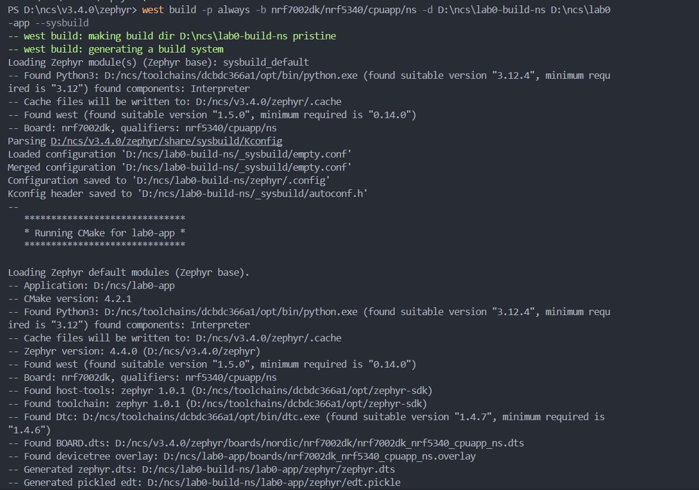
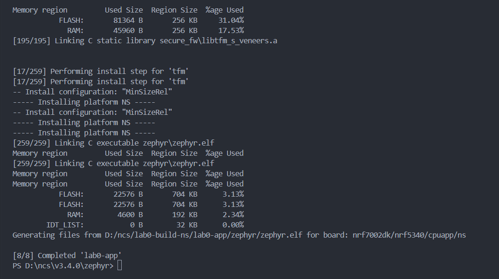
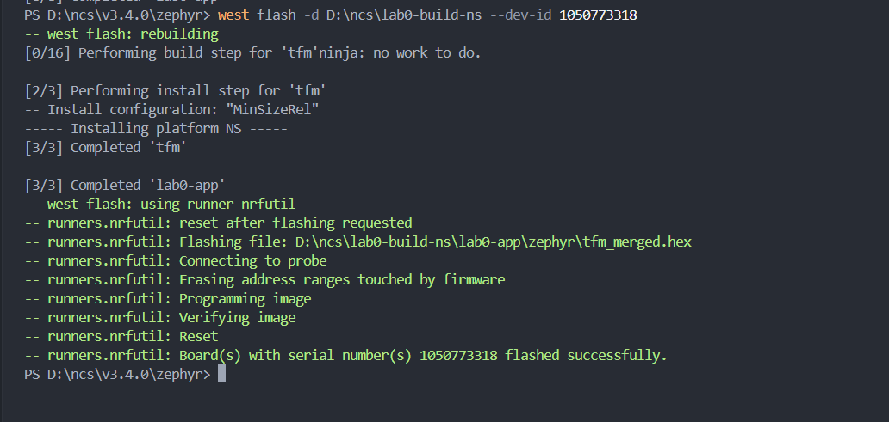

# ESE5180: Lab 0 Zephyr

<<<<<<< HEAD

| Team Member Name | Email Address                |
| ---------------- | ---------------------------- |
| Silin Chen       | chen47@engineering,upenn.edu |

**GitHub Repository URL: [github.com/ese5180/lab0-zephyr-skeleton.git](https://github.com/ese5180/lab0-zephyr-skeleton.git)**
==================================================================

**GitHub Repository URL:**

>>>>>>> origin/main
>>>>>>>
>>>>>>
>>>>>
>>>>
>>>
>>

## 1. Sample Header

## 2. Sample Second Header

## 3. Building with West

### 3.1 Build and Flash Evidence

Build output

Flash output

### West Commands

- `west init`: Initializes a workspace and its manifest repository.
- `west update`: Fetches and checks out the project revisions specified by the manifest.
- `west build`: Configures and builds an application using CMake and the build tool.
- `west flash`: Programs the built firmware onto a board using a supported runner.

### Build Arguments

Command used:

    west build -p always -b nrf7002dk/nrf5340/cpuapp/ns -d D:\ncs\lab0-build-ns D:\ncs\lab0-app --sysbuild

- `-p always`: Cleans the build directory before configuring and building.
- `-b nrf7002dk/nrf5340/cpuapp/ns`: Selects the non-secure application-core board target.
- `-d D:\ncs\lab0-build-ns`: Specifies the build output directory.
- `D:\ncs\lab0-app`: Specifies the application source directory.
- `--sysbuild`: Uses Zephyr's system build infrastructure to coordinate the build.

### Flash Arguments

Command used:

    west flash -d D:\ncs\lab0-build-ns --dev-id 1050773318

- `-d D:\ncs\lab0-build-ns`: Selects the existing build directory.
- `--dev-id 1050773318`: Selects the connected debug probe by serial number.
